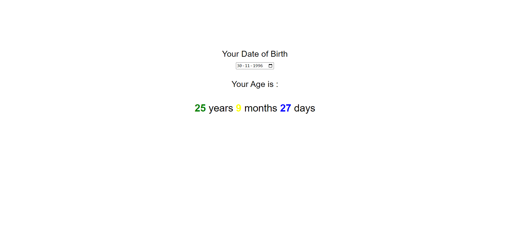

## What to build

we have to build Age Calculator.

## Input

## Techanology used

we have used HTML, CSS and JavaScript DOM

## What I have learned from this project

I have learned how to read date type input using eventListner on change input date value, and from input value I had calculated total year, month and day from that date to today.

## Output

### And

### Instructor

**Hitesh choudhary**
